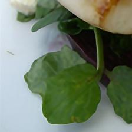
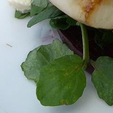

# PyTorch-SRGAN

 Source:  SRResNetVgg5,4:  (Ground Truth: )

PyTorch version of the paper: [Photo-Realistic Single Image Super-Resolution Using a Generative Adversarial Network](https://arxiv.org/abs/1609.04802) 
(currently it does not implement the GAN, but the srresnet + vgg19-5,4 loss)

you can train a net from scratch:
(optionally start training with just the pixel-wise loss on the resnet part:
`python srresnet.py --image-dir traindir --cuda --pretraining --images 16384 --batchSize 16`)

(use `--pretrained modelfile.pth` to continue from a pretraining or previous run for example)
`python srresnet.py --image-dir traindir --cuda --images 16384 --batchSize 16`

and then inference with the arguments:
`--pretrained model/model_epoch_80.pth --testing --test-image BSDS300/images/train/100075.jpg`
